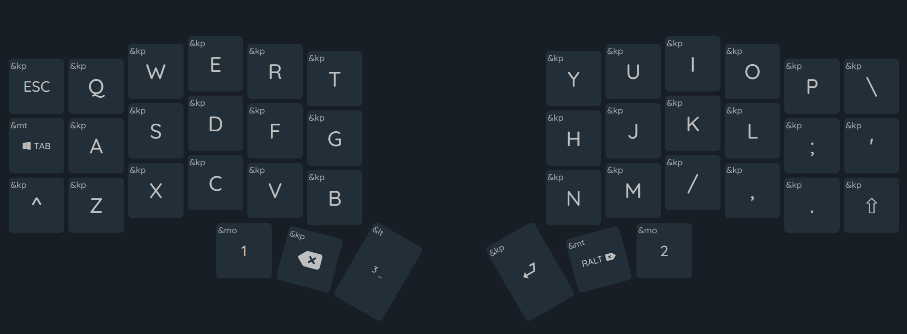
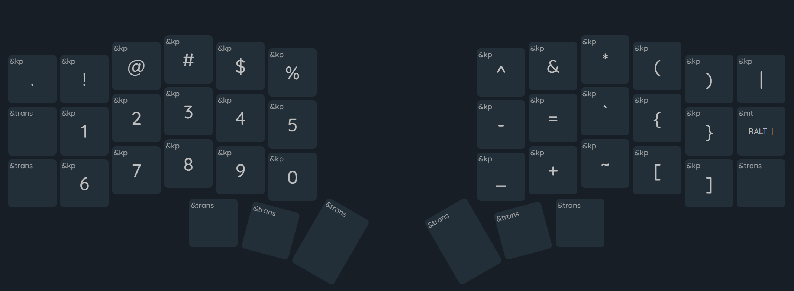
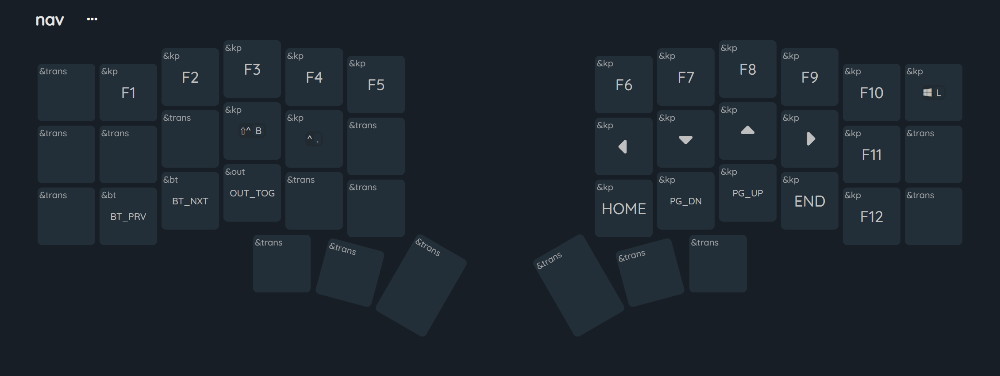
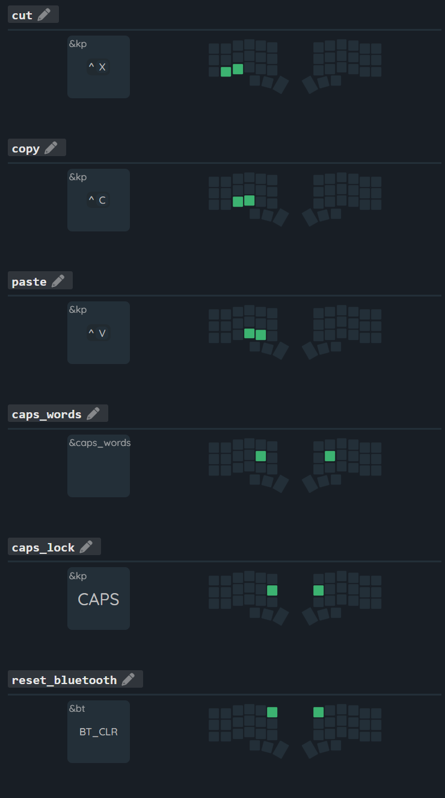

# My custom keyboard firmware
ZMK firmware/config for my wireless Corne keyboard

## Keyboard layout

### Default layer

### Symbols layer (1)

### Nav layer (2)

- below F3: CTRL+SHIFT+B - build solution (Visual Studio)
- below F4: CTRL+. - suggestions (Visual Studio/ VSCode)

## Combos
- default layer: cut, copy, paste, caps_word, caps_lock
- nav layer: reset_bluetooth

