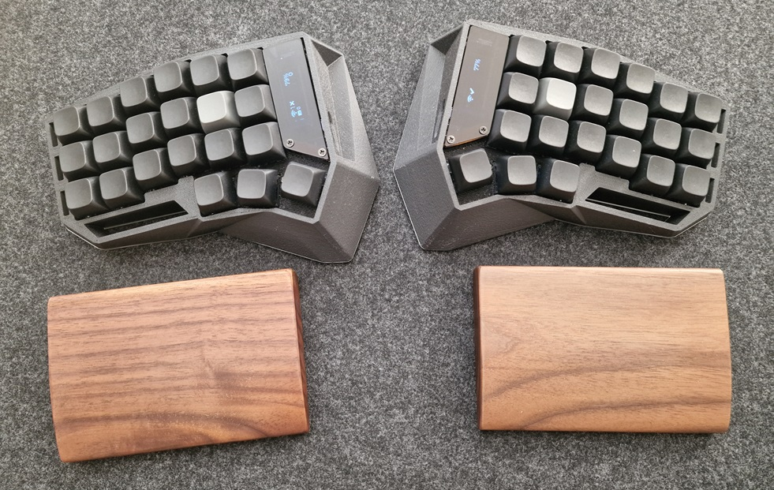
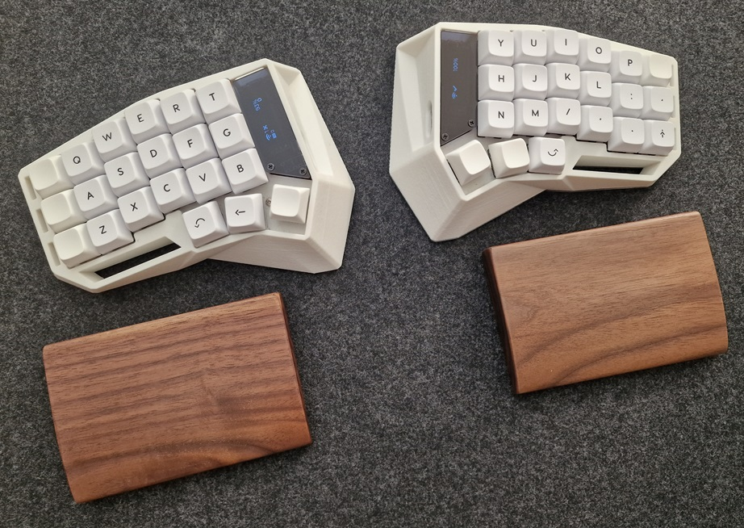
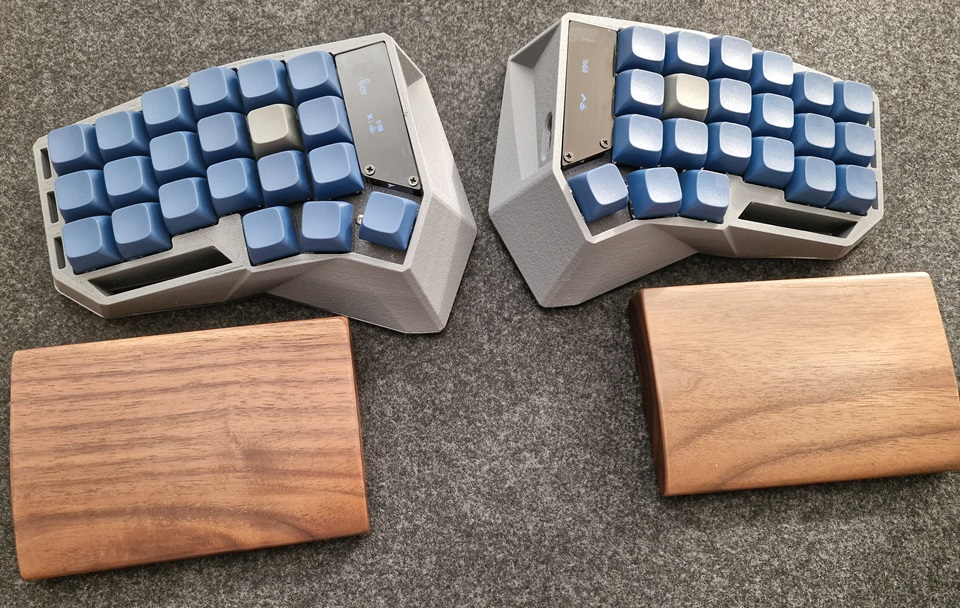
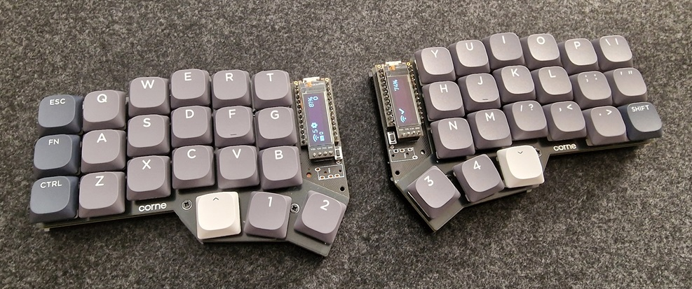

# My custom keyboards
ZMK firmware/config for my wireless Corne keyboards.

## Keyboard layout/ keymap

### Default layer

### Symbols layer (1)

### Nav layer (2)

- below F3: CTRL+SHIFT+B - build solution (Visual Studio)
- below F4: CTRL+. - suggestions (Visual Studio/ VSCode)

## Combos
- default layer: cut, copy, paste, caps_word, caps_lock
- nav layer: reset_bluetooth

## Keyboards

### Black case (thocky)
firmware: blk_corne_left, blk_corne_right

### White case (silent)
firmware: wh_corne_left, wh_corne_right

### Gray case (silent)
firmware: grs_corne_left, grs_corne_right

### Low profile
firmware: lp_corne_left, lp_corne_right
