# My custom keyboards
ZMK firmware/config for my wireless Corne keyboards.

## Keyboard layout/ keymap

### Default layer
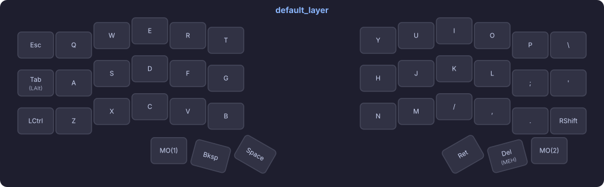

### Symbols layer (1)
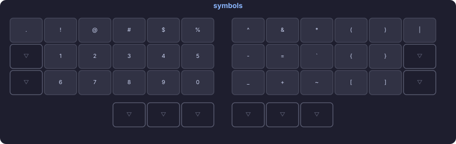

### Nav layer (2)
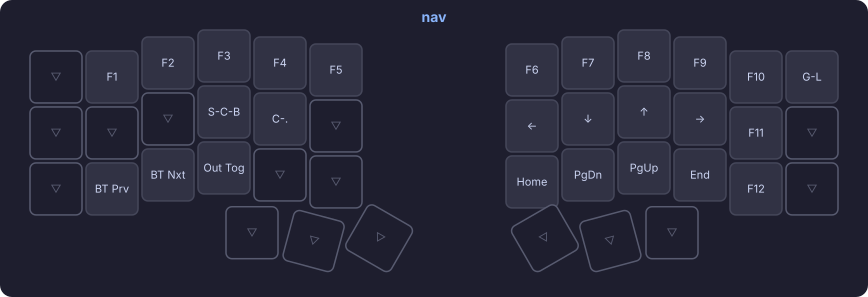

- below F3: CTRL+SHIFT+B - build solution (Visual Studio)
- below F4: CTRL+. - suggestions (Visual Studio/ VSCode)

## Combos
- default layer: cut, copy, paste, caps_word, escape (J+K)
- nav layer: reset_bluetooth

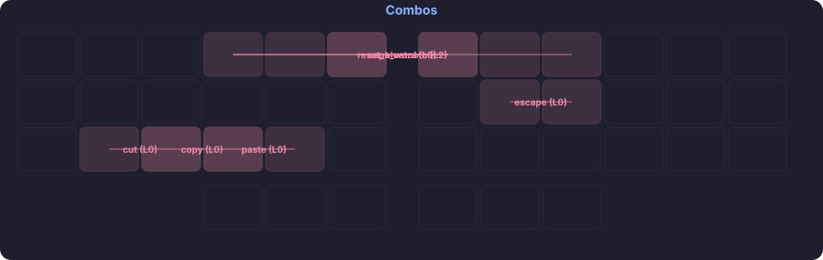

## Low profile (Eyelash Corne)

### Default layer
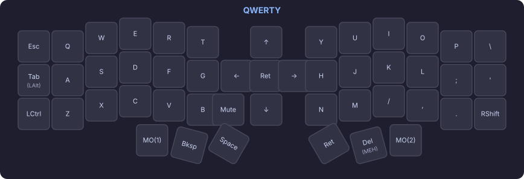

### Symbols layer (1)
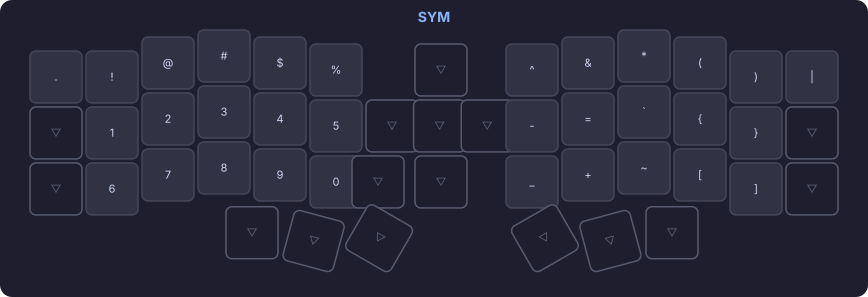

### Nav layer (2)
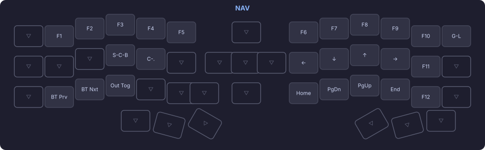

### Combos
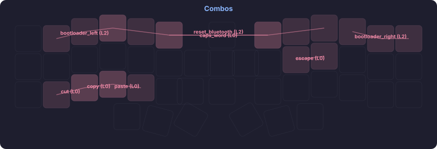

## Generating keymap visuals

```bash
cd scripts/generate-keymap-svg
dotnet run -- --keymap ../../config/corne.keymap --output ../../docs/img --layout corne
dotnet run -- --keymap ../../config/lpkeyb/eyelash_corne.keymap --output ../../docs/img --layout eyelash --prefix lp
```

## Keyboards

### Black case (thocky)
firmware: blk_corne_left, blk_corne_right
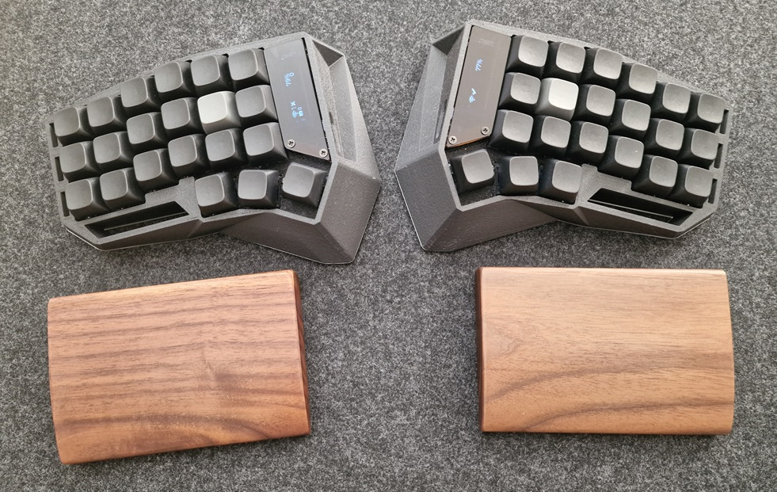

### White case (silent)
firmware: wh_corne_left, wh_corne_right
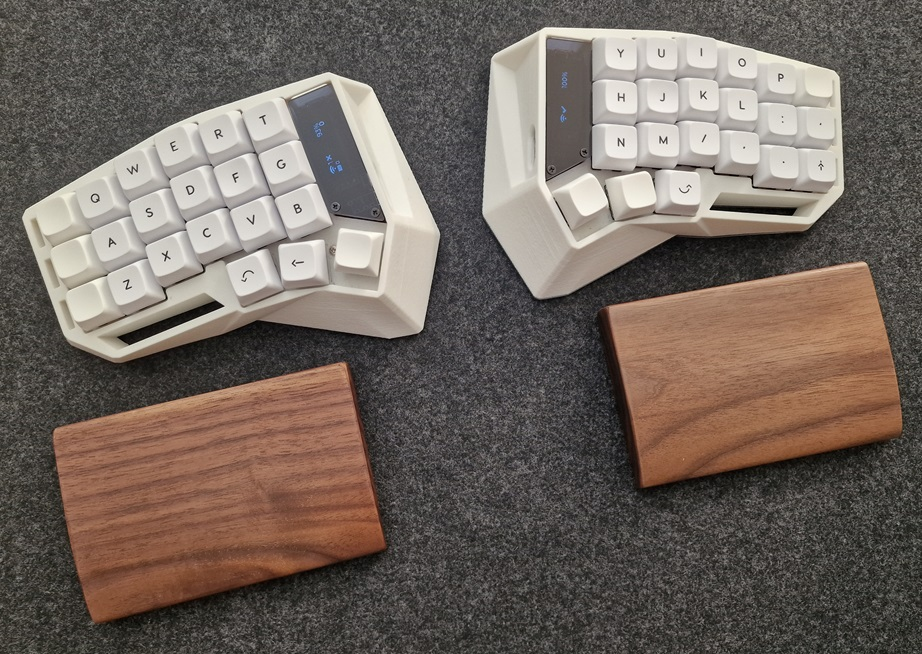

### Gray case (silent)
firmware: grs_corne_left, grs_corne_right
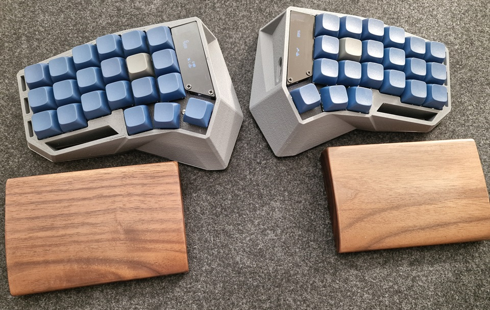

### Low profile
firmware: lp_corne_left, lp_corne_right
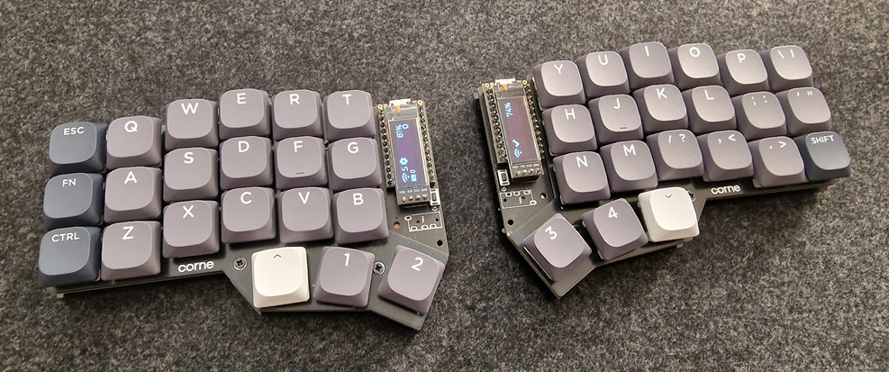
